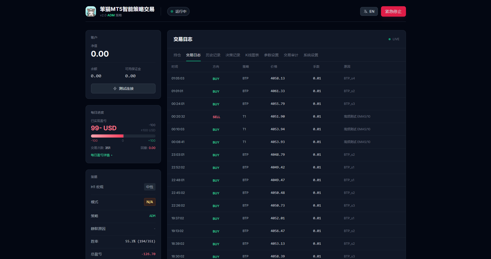

# MT5-Ai · 智能策略交易系统

> 面向 **MetaTrader 5** 的自动化量化交易桌面应用。以 XAUUSD（黄金）为主战场，把「策略研发 → 回测 → 加密分发 → 用户端热更新 → 实盘运行 → 监控告警」做成一条闭环的商用产品线。

---

## 一、项目简介

MT5-Ai 是一个打包为 Windows 单文件 exe 的量化交易系统。用户启动后弹出内嵌浏览器窗口，在网页中输入**卡密**登录，后台随即启动交易引擎：实时拉取 MT5 行情、运行多套策略、真实下单，并把状态、持仓、成交、决策推送到仪表盘与邮件。

> **运行前提：本系统必须与本机 MetaTrader 5（MT5）终端配合使用。** 行情获取、账户信息与订单执行全部通过 `MetaTrader5` 库调用**本机已登录的 MT5 客户端**完成，系统本身不直接连接经纪商服务器。缺少 MT5 终端时，行情与下单均无法工作。

核心设计目标：

- **免重装的策略热更新**：策略源码 AES 加密后经 Gitee 云端下发，用户端无需重新安装即可升级策略。
- **授权计费**：通过第三方卡密平台实现软件授权与心跳续期。
- **桌面级交付**：PyInstaller 打成单文件 exe，免 Python 环境开箱即用。

### 界面预览


*卡密验证登录页：输入卡密后由第三方平台校验并建立 30 秒心跳续期。*



*交易仪表盘：左侧为账户 / 每日进度 / 策略状态，右侧多标签展示交易日志、持仓、决策记录、K 线图表与参数热更新。*

---

## 二、系统架构

### 2.1 进程模型（多进程 + 文件 IPC）

引擎与 Web 是**两个独立进程**，通过 `data/` 下的 JSON 文件做进程间通信：

```
run.py（启动器 / 桌面外壳）
  ├─ 清理孤儿进程 + 释放 8000 端口
  ├─ 启动 Web 进程  → src/web/server.py (FastAPI + uvicorn, 0.0.0.0:8000)
  ├─ 等待就绪 → 打开 pywebview 窗口 http://localhost:8000/dashboard
  └─ 监控线程 _monitor()
        ├─ 检测 _auth_marker   → 启动引擎进程 (main.py)
        ├─ 检测 _stop_marker   → 停止引擎
        ├─ 检测 _restart_marker→ 仅重启引擎
        ├─ 引擎崩溃自动重启（连续 ≥5 次放弃）
        └─ Web 崩溃按退出码重启
```

共享文件（IPC 载体，均在 `data/` 下）：

| 文件 | 写入方 → 读取方 | 作用 |
| --- | --- | --- |
| `engine_state.json` | 引擎 → Web | 引擎每 30 秒原子写入：状态、策略、每日盈亏 |
| `config_hot.json` | Web → 引擎 | 参数热更新，引擎读取后 `setattr` 到 `StrategyConfig` |
| `strategy_switch.json` | Web → 引擎 | 在线切换策略 |
| `_auth_marker` / `_stop_marker` / `_restart_marker` | Web → run.py | 生命周期控制标记 |

### 2.2 模块职责

| 包 / 目录 | 职责 |
| --- | --- |
| `src/market_data/` | 行情层：`Tick` / `KlineBar` 模型，Infoway、AllTick（HTTP 轮询 / WebSocket / REST）三种数据源客户端 |
| `src/trading/` | 执行层：`mt5_executor.py`（主通道）、`mt4_bridge.py`（文件桥）、`mt4api_client.py`（DLL 直连） |
| `src/strategy/` | 策略层：引擎实现、指标库、策略管理、决策/成交落库、云端策略加密与动态加载 |
| `src/notifier/` | 通知层：QQ 邮箱 SMTP 告警，含下单 / 平仓 / 静默预警三套 HTML 模板 |
| `src/web/` | Web 层：FastAPI 服务 + 仪表盘 / 落地页等静态页面 |

### 2.3 端到端数据流

```
① 行情   MT5 终端 → MT5Executor 每秒轮询 symbol_info_tick → 构造 Tick → on_tick
② 策略   StrategyManager.on_tick → 当前策略 → TickAggregator 聚合 M5/M15 → 算指标判信号
③ 执行   executor.buy_market()/sell_market()/modify_sl() → mt5.order_send() 真实下单
④ 记录   Recorder → data/trades.db（SQLite：decisions / trades 两表）
⑤ 通知   EmailAlerter → QQ SMTP 发送下单/平仓邮件
⑥ 回传   引擎每 30 秒 save_engine_state() → engine_state.json；同时消费热参数与切换指令
⑦ 呈现   FastAPI /api/* 读取状态 + 直连 MT5 拉实时账户与持仓 + 读 DB → 前端轮询渲染
```

---

## 三、技术栈

**运行依赖**（`requirements.txt`）：

```
websockets>=12.0        # AllTick WebSocket 行情
aiohttp>=3.9            # AllTick REST / 轮询 HTTP
python-dotenv>=1.0      # .env 配置加载
MetaTrader5>=5.0        # MT5 Python API（核心执行通道）
fastapi>=0.104.0        # Web 后端
uvicorn>=0.24.0         # ASGI 服务器
infoway-sdk>=0.1.2      # Infoway 行情 SDK
```

代码中另用到：`numpy`（指标计算）、`webview`（pywebview 桌面窗口）、`pyinstaller`（打包）、`cryptography`（策略 AES 加解密）、`pydantic`。数据库为内置 `sqlite3`，无外部依赖。

---

## 四、策略体系

`src/strategy/` 下共 **12 个策略引擎**，分为「本地内置注册」与「云端加密下发」两类。

| 策略 | 文件 | 核心逻辑 |
| --- | --- | --- |
| **V2** | `engine_v2.py` | 参考实现。ADX + 布林带双状态机（趋势/震荡），H1 SMA 宏观过滤，同向 3 次触碰计数，会话冷却 |
| **V3** | `engine_v3.py` | V2 + D1 日线偏向过滤（低位只做多、高位只做空） |
| **V4** | `engine_v4.py` | V2 + 多重过滤（布林带宽、动量 ROC、H1 ATR 漂移、宏观 SMA+RSI、M5 RSI），多阶段移动止损 |
| **V5** | `engine_v5.py` | RSI 背离 + H1 趋势 + 布林触碰，止盈 80pt / 止损 10pt，240 分钟超时 |
| **B1** | `engine_b1.py` | EMA8/21/50 + RSI + 布林带，M15，四阶段棘轮移动止损（⚠️ 使用内存虚拟仓位，未下真实订单） |
| **B2** | `engine_b2.py` | EMA8/21/50 + RSI + 布林带信号引擎，M15，真实下单，每日状态持久化，移动循环锁定利润 |
| **BTP** | `engine_btp.py` | M1 动量衰竭超短线：M15 关键位 + M5 EMA/FVG 定向 + M1 入场；含每日止损/目标/次数上限 |
| **T1** | `engine_t1.py` | 高频头皮**测试**策略（无盈利目标），M1 均线判向，15 秒持仓检查 |
| **G1** | `engine_g1.py` | XAUUSD 小资金右侧趋势，时段优化 + EMA/VWAP，自适应止盈止损（每 25 笔网格搜索） |
| **G2** | `engine_g2.py` | XAUUSD 三线（EMA10/20/30）微利，全天候，固定止盈 +2.0U / 止损 -1.0U |
| **M1** | `engine_m1.py` | 亚欧时段小资金策略，布林回归 + RSI + EMA50 趋势过滤，ATR 止损止盈，连亏冷却 |
| **XAU / ADM** | `engine_xau.py` | 自适应双模：H4 市场状态 + H1 结构（关键位 / Order Block / FVG）+ M5 入场评分，震荡走回归、趋势走延续 |

**云端加密策略**（`data/cloud_strategies/*.enc`）：`ADM`、`BTP`、`Queen`、`T1`、`XAU`、`自适应双模`，由 `manifest.json` 记录版本。其中 `Queen` 无本地源码，仅以加密态存在。

> 注：`main.py` 内置注册的是 `V2`、`B1`、`T1`；其余引擎目前主要经云端 `.enc` 形式加载。

---

## 五、MT4 / MT5 接入

项目在同一代码库中实现了三条独立技术路线：

1. **MT5 官方 Python API（当前主用）** — `mt5_executor.py`
   单例执行器，所有阻塞调用投递到线程池；支持市价单、限价单、改止损、撤单；自动探测 filling mode（FOK/IOC/RETURN）；内置**下单速率限制 + 指数退避**；成交与余额快照写入 `memory.json`。

2. **MT4 EA 文件桥（备选）** — `mt4_bridge.py` + `EA_PythonBridge.mq4`
   Python 写 `cmd.txt`（`ACTION:xxx` + `KEY:value` 文本协议），EA 在 `OnTick` 中执行后写 `rsp.txt`，Python 轮询读取。支持 ping / quote / account / buy / sell / close_all / orders。

3. **MT4 服务器直连（实验性）** — `mt4api_client.py` + `lib/*.dll`
   通过 `ctypes` 封装第三方 `mt4api.dll`，无需本地 MT4 终端即可连接服务器；回调经线程安全队列转投 asyncio。

---

## 六、Web 仪表盘与 API

**页面**：`/`（营销落地页）、`/dashboard`（主仪表盘）、`/landing`。

**鉴权**：对接第三方卡密平台，`/api/auth/login` 用卡密登录（MD5 签名 + Base64 加解密 + 服务器时间校验），成功后每 30 秒心跳；未认证时中间件对 `/api/*` 返回 401。

**主要接口**：

| 分类 | 接口 |
| --- | --- |
| 鉴权 | `POST /api/auth/login`、`GET /api/auth/status`、`POST /api/auth/logout` |
| 状态交易 | `GET /api/status`、`GET /api/positions`、`POST /api/killswitch`、`POST /api/positions/{ticket}/close`、`POST /api/positions/close-profitable` |
| 配置策略 | `GET/POST /api/config`、`GET /api/config/limits`、`GET /api/strategies`、`POST /api/strategies/switch` |
| 连接设置 | `POST /api/mt5/test`、`GET /api/mt5/symbols`、`GET/POST /api/settings`、`POST /api/restart`、`POST /api/test-email` |
| 数据查询 | `GET /api/trades`、`/api/trades/history`、`/api/trades/stats`、`/api/trades/audit`、`/api/decisions`、`/api/klines` |
| 管理员 | `/api/admin/strategy/list`、`upload`、`backtest`、`publish`、`check-updates`（需 `X-Admin-Key`） |

**前端**：纯 JavaScript + Tailwind 暗色单页，多标签轮询（持仓 / 决策 / 历史 / 审计），含 Killswitch、单仓平仓、一键平盈利仓、参数热更新、`.env` 在线编辑与重启等能力。

---

## 七、配置说明

配置集中在根目录 `.env`（参考 `.env.example`）：

| 键名 | 作用 |
| --- | --- |
| `MT5_LOGIN` / `MT5_PASSWORD` / `MT5_SERVER` | MT5 账户与服务器 |
| `MT5_SYMBOL` / `MT5_VOLUME` | 交易品种（默认 XAUUSD）与手数 |
| `ACTIVE_STRATEGY` | 启用策略（V2/V3/V4/V5/B1/B2 …） |
| `EMAIL_*` | 邮件告警（发件/收件/授权码/SMTP） |
| `INFOWAY_TOKEN` / `ALLTICK_TOKEN` | 行情数据源凭据 |
| `GITEE_OWNER` / `GITEE_REPO` / `GITEE_TOKEN` | 云端策略仓库 |
| `ADMIN_KEY` | 管理员接口密钥 |

策略运行参数（`StrategyConfig`）可通过 `/api/config` 在线热更新，并由 `CONFIG_LIMITS` 做范围校验。

---

## 八、快速开始

> **前置要求：必须搭配 MetaTrader 5 一起使用。** 本系统通过 `MetaTrader5` 库直接控制**本机**的 MT5 终端，因此运行前需：
> 1. 在**同一台 Windows 机器**上安装并登录 MetaTrader 5 客户端；
> 2. 在 MT5 中开启「工具 → 选项 → 智能交易系统 → 允许算法交易」；
> 3. `.env` 中的 `MT5_LOGIN` / `MT5_PASSWORD` / `MT5_SERVER` 与 MT5 终端所登录账户保持一致。
>
> 未安装 MT5 终端时行情与下单均不可用；缺少账户配置时引擎不会启动。

```bash
# 1. 安装依赖
pip install -r requirements.txt

# 2. 配置
copy .env.example .env    # 填入 MT5 账号、行情 Token 等

# 3. 运行（自动拉起 Web + 引擎）
python run.py

# 或仅以脚本方式调试引擎
python main.py
```

## 九、打包

```bash
pyinstaller build.spec
```

`build.spec` 以 `run.py` 为入口打单文件 exe（名称 `MT5-Ai`，无控制台，内置图标），并收集 `src/web/static` 静态资源与全部策略引擎模块。

---

## 十、目录结构

```
MT4-Ai/
├── run.py                    # 启动器 / 桌面外壳
├── main.py                   # 交易引擎入口
├── build.spec                # PyInstaller 打包配置
├── requirements.txt
├── .env.example              # 配置模板
├── src/
│   ├── market_data/          # 行情数据源
│   ├── strategy/             # 策略引擎 + 指标 + 管理 + 云端加密
│   ├── trading/              # MT5 执行器 / MT4 桥 / DLL 直连
│   ├── notifier/             # 邮件告警
│   └── web/                  # FastAPI 服务 + 仪表盘页面
├── lib/                      # MT4 相关 DLL 与 .mq4 EA 源码
├── img/                      # README 截图（卡密登录页 / 交易仪表盘）
├── data/                     # 运行态：状态 / 配置 / 数据库 / 加密策略
├── docs/                     # 项目文档（策略指南、API 手册、问题清单）
└── scripts/                  # 回测与策略发布辅助脚本
```

---

## 十一、安全提示

- **`.env` 存放真实交易账户密码、邮箱授权码、行情 Token 与代码仓库 Token，务必排除出版本控制**。
- 策略加解密密钥、卡密平台凭据目前硬编码在源码中，随 exe 分发即等同于对外公开，商用前建议外置为运行时配置。
- Web 服务默认监听 `0.0.0.0:8000` 且 CORS 全开，建议改为仅监听本机并收紧跨域策略。
- `lib/` 下的第三方 DLL 来源需自行评估；配套的 MT4 直连组件需单独申请授权。

## 十二、已知问题

项目自带 `docs/PROJECT_ISSUES.md`，记录了 27 条分级问题（致命 / 严重 / 中等 / 轻微），主要集中在：

- 引擎与 Web 跨进程文件 IPC 存在读写竞态，建议改用 SQLite 或单进程内嵌；
- 部分策略引擎为虚拟仓位（如 B1）、或未在 `main.py` 注册，功能尚未完全落地；
- 中文路径与 PowerShell 编码问题曾多次污染源码（BOM、转义符），导致前端白屏；
- `decisions` / `trades` 两表无外键、无索引，决策到成交的追溯链路较弱；
- 邮件通知无重试、QQ SMTP 存在限频风险。
